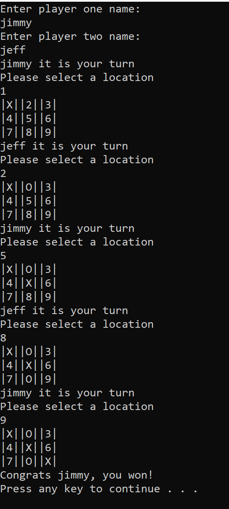

# Lab 4 Tic Tac Toe

This is a console app that simulates the classic tic tac toe game with two players. The app prompts inputs from two different players, then each individual player could take turns inputting their coordinates on the game board.

The winner is determined by standard Tic Tac Toe rules. If the board is populated without a winner, a draw is outputted.


## Getting Started

Open the project with Visual Studio, and run (Ctrl + F5). 

Alternatively, you can navigate to project directory containing Program.cs file with PowerShell, then do the following.

 ```
 dotnet run
 ```

 Proceed to play the game with console prompts.

 ## Visualization

 

 ## Contributors

 Code Fellows for starter code. 

 Jeff Weng

 Jimmy Nguyen